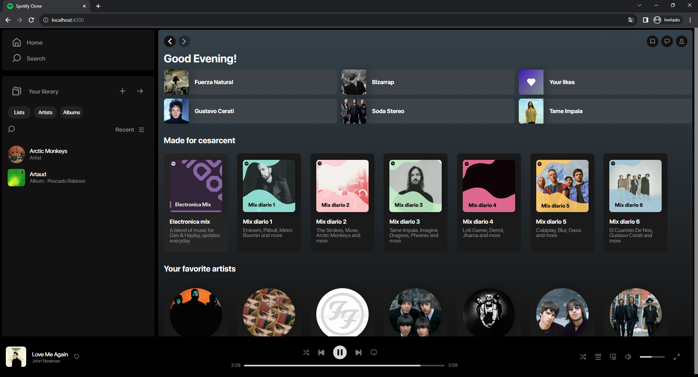

# Spotify Clone

Este es un clon de Spotify construido con Angular.

## Capturas de Pantalla

## Tecnologías Utilizadas

- Angular CLI 16.0.5

## Requisitos Previos

Asegúrate de tener Node.js y Angular CLI instalados en tu sistema. Si no los tienes, puedes instalarlos siguiendo estos pasos:

- [Node.js](https://nodejs.org/)
- Angular CLI: `npm install -g @angular/cli`

## Instalación

1. Clona este repositorio: `git clone https://github.com/CesarCent17/spotify-clone`
2. Navega al directorio del proyecto: `cd spotify-clone`
3. Instala las dependencias: `npm install`

## Uso

1. Inicia la aplicación en modo de desarrollo: `ng serve`
2. Abre tu navegador y visita `http://localhost:4200`
